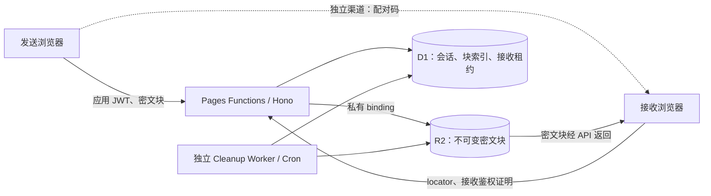

# 基于配对码与 R2 的端对端加密文件传输技术方案

> 历史方案：用户于 2026-10-02 决定只使用 WebRTC。当前实施依据为 `webrtc-tech.md` 和 `webrtc-protocol.md`；本文件中的 R2/离线接收建议不再生效。

日期：2026-10-02。状态：设计建议，尚未实现。接口和 SQL 详见 [protocol.md](protocol.md)。

## 1. 结论与默认范围

推荐采用“浏览器加密 → 私有 R2 中转密文 → 浏览器解密”的异步传输模式。配对码由浏览器生成，经双方另行约定的渠道传递；后端管理会话、权限和生命周期，但不持有明文配对码或文件解密密钥。

| 项目 | 首版建议 | 说明 |
| --- | --- | --- |
| 发送权限 | 复用现有登录 JWT | 控制存储滥用；匿名发送后续另加配额/挑战 |
| 接收权限 | 无需应用账号 | 配对码证明 + 接收会话 token |
| 配对码 | 26 个随机 Base32 字符 | 130 bit；支持复制、二维码，显示时分组 |
| 文件 | 单文件，最高 1 GiB | 应用级初始限制，非 R2 上限 |
| 明文分块 | 8 MiB | 每块独立加密、上传与重试 |
| 并发 | 上传 2，下载预取 2 | 解密后按顺序写入，控制内存 |
| 有效期 | 从创建起 24 小时 | 上传窗口 2 小时；过期由请求时检查 |
| 接收次数 | 1 个成功接收会话 | 同一会话允许重复请求和续传 |
| 暂停恢复 | 同一页面自动重试/暂停 | 刷新后恢复作为单独增强，不默认承诺 |
| 保存 | 支持流式文件写入时走流式保存 | 其他浏览器保守限制为 100 MiB Blob，移动端先限 32 MiB，并实测 |

上述数值是建议默认值，可配置；发送方登录和文件上限尚未被用户确认。

“端对端加密”表示文件在发送浏览器加密，在接收浏览器解密。网络路径包含 R2 中转，不代表网络层直连，也不要求双方同时在线。

## 2. 当前项目接入点

- 前端：React 18、Vite、MUI，功能入口在 `src/component/FeaturePanel/index.tsx`。
- 后端：`functions/api/[[routes]].ts` 转发到 `lib/hono/index.ts`，部署为 Cloudflare Pages Functions。
- 数据：已有 D1 `DB` binding；尚无 R2 binding。
- 鉴权：当前 `/api/*` 默认套用应用 JWT；新传输路由需要独立分类，不能将整个前缀视为无需鉴权。
- HTTP：`src/utils/http.ts` 使用表单编码和 3 秒默认超时，并会打印响应。传输模块使用独立 fetch 客户端，禁止打印带能力凭据的响应。
- 现有 `lib/hono/utils/encrypt.ts` 用服务端密钥和固定 IV，不能用于新文件加密。新协议全部在客户端实现。
- 当前 `clipboard-cleaner` 由请求显式调用；函数名为 scheduled 不意味着已经注册平台定时任务。

## 3. 架构



R2 不开放公共访问、不配置 r2.dev。首版所有数据经同源 Worker API 中转，避免额外 S3 凭据和浏览器 bucket CORS。对象使用随机 transferId/fileId 和数字块序号，真实文件名只在加密 manifest 中。

首版推荐“一块一个对象”，例如 `v1/{transferId}/{fileId}/{index}.bin`。这使上传幂等、缺块校验、下载重试和清理更直接。相比 multipart 合并单对象，会增加对象/操作数；成本计算见第 11 节。

后续吞吐瓶颈出现后，可改为预签名 multipart 直传和单对象 Range 下载。加密块与 R2 multipart part 是两个层次，不能假定永远一一对应；最小 part 大小、part 上限和最终对象封装需重新设计。[R1][R3][R4]

## 4. 威胁模型与边界

保护范围：链路抓包、R2/D1 数据泄露、仅能读取后端日志或存储的攻击者、密文块被篡改、调换、截断或跨会话拼接。服务器即使得到接收鉴权凭据，也不能据此派生文件密钥。

可见元数据：IP、用户账号、创建/访问时间、明文总大小（本方案用于配额）、密文块数量/大小、locator、接收状态。若后续需要隐藏精确大小，可引入 padding，首版不宣称隐藏流量信息。

不能保证：前端脚本被恶意发布或 XSS 后仍保密、用户设备被攻破、配对码泄露、接收者不复制文件、服务端不拒绝服务。Web 应用的加密代码由站点提供，恶意站点发布可窃取配对码；抵抗主动恶意运营者需额外的可验证独立客户端。

配对码必须通过双方认可的独立渠道传递。所有知道配对码的人都具备接收能力；本方案不验证真实身份。

## 5. 配对码：必须先决定长码还是短码

### 5.1 推荐长随机码

用 `crypto.getRandomValues()` 产生 26 个均匀分布的 Crockford Base32 字符，熵为 130 bit。编码字母表为 `0123456789ABCDEFGHJKMNPQRSTVWXYZ`；展示可按 5/5/5/5/6 分组。规范化只允许大小写转换及去除空格/连字符，其他字符拒绝；不允许任意用户口令。

用独立域标签从规范化代码生成两个不同用途的值：

```text
C           = UTF8(normalizedCode)
locator     = SHA256(UTF8("gy-transfer/v1/locator:") || C)
authSecret  = HKDF-SHA256(C, salt=32 zero bytes,
                        info="gy-transfer/v1/receiver-auth", length=32)
authVerifier = SHA256(authSecret)
```

创建只发送 locator/authVerifier。接收方先用 locator 获取信封，再在本地解密；正式领取只发送独立 authSecret。服务端从不收到 C。locator、authSecret、authVerifier 都必须视为敏感数据，不记录完整值。AES 使用 256 bit 密钥，不代表整体配对码方案具备 256 bit 安全强度；代码熵约为 130 bit。

公开 locator 可作为离线猜测验证器，因此这套协议只允许足够随机的长码。130 bit 随机值不需要用慢密码 KDF 增加口令猜测成本；HKDF 用于密钥派生和用途隔离，而不是强化弱口令。[R6][R7]

### 5.2 若必须用 6～8 位数字码

不能直接 PBKDF2(短码) 然后上传可校验的 AEAD 信封；攻击者拿到信封即可离线枚举。盐和服务器限流不能阻止这种离线攻击。

需要采用经过审查的 PAKE 协议与实现，例如基于密码认证的临时会话，结合严格在线尝试限制和一对一配对。双方在线协商密钥后，可继续用 R2 中转。是否支持“发送方退出后仍凭短码领取”需要单独的协议与部署评估，不能用简单哈希检索方案替代。

短码是独立增强方向，在确认用户要求与可用审计库之前不写自制 PAKE。[R8]

## 6. 加密协议 v1

### 6.1 密钥与信封

- 创建传输时，发送浏览器随机生成 transferId（UUID）、fileId（128 bit）、fileKey（256 bit）、salt（128 bit）。服务端验证格式并保证 transferId 不冲突。
- `wrapKey = HKDF-SHA256(C, salt, info="gy-transfer/v1/wrap:" + transferId, 32 bytes)`。
- `metaKey = HKDF-SHA256(fileKey, salt, info="gy-transfer/v1/manifest:" + transferId, 32 bytes)`。
- 使用 AES-256-GCM、128 bit tag 包裹 fileKey，wrap IV 为独立随机 12 字节。用 metaKey 加密 manifest，manifest IV 为独立随机 12 字节。
- wrap AAD 固定为 UTF8(`gy-transfer/v1/wrap:` + transferId)；manifest AAD 固定为 UTF8(`gy-transfer/v1/manifest:` + transferId)。
- 接收端固定允许 v1/HKDF-SHA256/AES-256-GCM，不接受服务端任意指定算法、KDF 轮数或未知协议降级。

服务端信封：`{version,salt,wrapIv,wrappedFileKey,manifestIv,encryptedManifest}`，二进制字段使用无 padding Base64URL。服务端只做结构和尺寸校验。

manifest 明文：`{version,transferId,fileId,name,mime,plainSize,chunkSize,totalChunks,noncePrefix,expiresAt}`；所有数值严格校验后才开始下载。真实文件名和 MIME 不写 R2 metadata、日志或 D1 明文字段。

### 6.2 分块、nonce 和 AAD

```text
B = 8 * 1024 * 1024
N = max(1, ceil(plainSize / B))
IV(i) = noncePrefix[8 bytes] || uint32_be(i)
AAD(i) = UTF8("gy-transfer/v1/chunk:")
         || UUID transferId 的原始 16 bytes
         || fileId[16 bytes]
         || uint32_be(i) || uint32_be(N)
         || uint64_be(plainSize) || uint32_be(B)
cipher(i) = AES-256-GCM(fileKey, IV(i), AAD(i), plain(i))
```

index 从 0 开始；B/N/文件大小以无符号大端整数编码。零字节文件也产生一个 16 字节密文块，验证接收完整性。每块密文长度为该块明文长度 + 16。

每个新传输生成新 fileKey。重试必须重发完全相同的密文；不能在同一 fileKey/IV 下重新加密改变后的明文。页面重新选择文件、修改文件或不确定密钥/块一致性时必须开启新传输。实现测试应固定端序和 UUID 字节转换，避免 JSON 序列化差异。[R6]

### 6.3 完整性

AES-GCM 验证每块内容及所属会话/位置；加密 manifest 绑定大小与块数。接收端确认收齐 N 块、每块 tag 通过、最终明文字节数等于 plainSize，才关闭文件并发送完成回执。

上传每块附带密文 SHA-256，服务端使用有上限的读入校验实际长度和哈希，记录并以条件写入保证不可覆盖。这个 hash 用于重试一致性和传输错误排查，不当作端对端安全证明。R2 ETag 仅作对象版本信息，不当作明文 SHA-256。

首版不依赖整个文件一次性 `arrayBuffer()` 或 `subtle.digest()`。若后续需要全文件明文 digest，采用经审查的增量哈希实现，并在 manifest 内保存；不会把明文 hash 暴露给服务端。

## 7. 发送与接收流程

### 7.1 发送

1. 选择文件、检查浏览器和应用上限；生成配对码、密钥和公开大小参数。
2. POST 创建会话，提交 locator、authVerifier、公开大小参数；quota 预留和 session 插入一起提交。获取服务端 expiresAt 后构造并加密 manifest，再 POST envelope 冻结信封，避免客户端时间漂移。
3. File.slice() 读取每块，Web Worker 做 AES-GCM；密文最多保留两个块，逐块上传。
4. 每块写入前创建/确认 D1 pending 记录；只接受相同 index/大小/密文 hash 的重试。
5. 写 R2 私有对象，核对结果后把块标记 ready；写成功但 D1 失败时，由相同块重试修复。
6. 完成接口检查全部块 ready、长度正确，再 CAS 将 uploading 切换 ready。complete 幂等。
7. UI 显示“可以接收”，提供配对码复制；上传过程中显示“尚未上传完成”。发送方可关闭页面或撤销。

### 7.2 接收

1. 规范化输入，计算 locator；POST open 获取对应 ready 会话的加密信封。
2. 浏览器派生 wrapKey，解包 fileKey，解密并验证 manifest 和 transferId；错误码/篡改在领取前失败。
3. 展示文件名/大小/有效期。用户选择保存位置，或确认 Blob 下载。
4. 生成随机 claimId（幂等标识），POST claim 携带 authSecret；服务端核对 authVerifier，原子取得唯一接收租约并返回短期 token。
5. 按 index 下载密文块，验证 AES-GCM，然后顺序写入；网络重试沿用同一租约，不增加接收次数。
6. 大文件下载中按需刷新 token/租约；过期和撤销优先于 token。
7. 收齐并保存后，POST ack 幂等标记 consumed，触发后台清理。Blob fallback 的浏览器无法证明系统最终保存，ack 仅表示解密与下载交付完成，UI 要区分。

### 7.3 续传和失败

- 网络错误：指数退避加随机抖动，最多 5 次，尊重 Retry-After；暂停只停止新块，AbortController 可取消在途请求。
- 接收 token 建议 15 分钟，租约空闲超时 30 分钟，活跃租约可续期至传输 expiresAt。单次接收不是“一次 GET”。
- 同一 claimId 重试返回同一接收会话并刷新 token；首次 claim 回包丢失不会永久占用接收名额。
- 接收租约超时未 ack 可释放并重新领取，默认只阻止第二个同时活跃接收者；不能宣称只允许一个物理副本。
- 上传首版只支持页面存活时恢复。刷新恢复需重新选择文件并验证每块一致性；IndexedDB 不默认持久化 fileKey/配对码。
- 下载刷新恢复需重新输入配对码、重新授权文件句柄并确认已有块；这属于后续增强。不得只凭某个“已下载 offset”跳过加密校验。
- 解密失败立刻 abort 临时输出，不留下被当成成功的残缺文件；不允许跳过失败块。

## 8. 并发与跨存储一致性

R2 与 D1 没有跨服务事务。设计采用不可变对象、D1 条件更新和可重试补偿，不能在描述中声称它们一起原子提交。

- 单块对象使用固定且不可覆盖的 key，R2 conditional PUT（If-None-Match: *）失败后 HEAD 比对大小/metadata hash，仅允许相同密文重试。[R1]
- D1 pending 记录绑定 index、hash、长度；使用 INSERT ... SELECT/条件 UPDATE 和唯一约束，避免“先 SELECT 再写”的竞态。
- finalize 只允许预期块数均 ready 且总尺寸匹配；原子状态条件挡住新块提交。相同块的晚到重试不能改变既有 R2 对象。
- claim 使用 D1 原子 batch 中的条件 reserve + 唯一 live_claim_id，不依赖进程内锁或 KV 同步。
- revoke/expire 首先使会话不可读，再清理；清理与在途 PUT 可能交错，因此保留 tombstone、延迟二次扫尾并用 R2 lifecycle 兜底。
- 多对象清理分页、重试、记录 cursor。不能因“DELETE 已调用”就标记全部清理成功。

详细 CAS 和失败矩阵见 protocol.md。

## 9. 生命周期与部署

业务有效期按数据库 UTC Unix 毫秒 expires_at_ms 比较，每个敏感请求都校验。即使 Cron 暂停，过期数据也不能继续下载。JWT/接收 token 尚未到期不覆盖这个判断。

Pages Functions 当前保持请求处理；独立部署 `transfer-cleaner` Worker，以 Cron 每 5 分钟扫描到期、撤销、失败和已 ack 会话，绑定同一个 D1/R2。现有 Pages wrangler 配置不直接当作 Cron Worker 部署。[R2][R5]

清理过程：标记不可读 → 分页删对应 R2 前缀 → 确认无对象 → 删块表/释放配额 → 保留 48 小时 tombstone 并二次扫尾 → 最终删会话和 token hashes。失败保留任务和 retry 时间，避免盲目全 bucket 扫描。

R2 使用 Standard，建议设置对象创建后 3 天删除的生命周期兜底，覆盖 24 小时传输和清理延迟。生命周期不是精确秒级定时器；官方文档说明对象通常在到期后 24 小时内移除。产品表达应为“到期不可领取，后台删除密文”，不能保证第 24 小时立刻物理擦除。[R4]

首版采用普通对象分块，不需要 multipart abort；后续 multipart 版本必须另配未完成上传清理规则。

## 10. 权限、滥用和浏览器安全

- 创建/状态/上传/完成/撤销：应用 JWT + sender_user_id；逐接口明确校验，不能仅凭 transferId 访问。
- open：允许匿名，只返回信封；按 IP 频率控制，无法有效领取时统一错误，不透露 sender 身份。
- claim：authSecret 校验 + D1 接收名额原子占用；下载/续期/ack：独立短期接收 token + 每次查 session 状态/租约。
- 接收 token 采用独立服务端 secret 的 HMAC-SHA256 派生 256 bit opaque capability，D1 只保存 SHA-256 与到期时间；同一 claimId 重试可恢复相同 token。无需复用应用 TokenSecret，也无需新增 JWT 协议，详见 protocol.md。
- 建议配额：每用户 3 个活跃传输、2 GiB 待清理密文、每日创建 20 次；原子预留大小，上传失败/清理后释放。具体值可配置。
- 限流建议：create 每用户 10/min、open/claim 每 IP 20/min，再加站点总量/成本熔断。边缘限流为柔性控制，硬配额由 D1 条件语句保证；KV 不作精准全局计数器。
- 内容长度和 JSON 大小校验：JSON ≤ 64 KiB；块 ≤ B+16；既检查 header，也限制实际读取字节，拒绝伪造 Content-Length。
- Worker 单次只处理一个有界块，不能 request.arrayBuffer() 不设上限；限制前端并发并测同 isolate 请求累积的内存。
- 同源 API，Origin/Content-Type 校验，禁止任意跨域来源；R2 响应统一 application/octet-stream/no-store/nosniff，不直接展示上传内容。
- 传输页面不使用第三方分析脚本；CSP 按现有 MUI emotion 样式与站点实际资源配置并实测，不直接套用导致页面无法运行的模板。
- React 把文件名当文本显示，保存时去掉路径、控制字符和危险平台字符；不把 manifest MIME 当可信渲染指令。
- 不能做服务端明文病毒扫描或内容预览；若需扫描，可在接收浏览器或保存后的设备安全软件完成。
- 配对码、authSecret、fileKey、接收 token、信封均不进入 console/URL/query/referrer/日志；默认仅内存。可选二维码直接承载配对码，首版不自动上传二维码内容。

## 11. 性能与费用

设文件大小为 F、块大小为 B，则 N=max(1,ceil(F/B))。加密块额外容量为 16N 字节，另有很小的信封。1 GiB / 8 MiB = 128 个对象，tag 总开销 2,048 字节。

通常每次传输需要 N 次 R2 PUT、N 次 GET、若干 LIST/HEAD/清理操作、N 次块索引写入和 N 次下载权限校验。重试、统计轮询和清理扫描需另计。大规模使用后，块对象数可能比容量更早成为成本来源。

R2 存储 GB-month 按计费周期内每天存储峰值的平均值计算（官方按 30 天举例），不是每月上传总量，也不是简单按小时累计。删除减少后续存储占用，但不抹掉当天峰值。容量预测要包含清理延迟、孤儿对象与生命周期兜底；使用 GB/GiB 的实际换算。当前 Standard 免费存储为 10 GB-month，具体账单仍需核对所有对象与操作。[R11]

浏览器内存目标 O(并发块数 × B)，并考虑加密/解密复制和缓冲。Blob fallback 是 O(F)，因此移动端需要保守限额；不得以 R2 支持大对象推断浏览器能够保存大文件。

首版采用 2 秒状态轮询，页面隐藏时退避，终态停止。没有必须引入 WebSocket/DO 的需求。若网络访问质量成为问题，再评估直传/下载与区域性能，尤其应实测用户所在网络的 Cloudflare 可达性。

## 12. 前端与代码拆分

FeaturePanel 添加“文件传输”入口，建议路由 `/transfer`，页面提供发送/接收两个 Tab。独立页面便于移动端、大文件进度和重新输入配对码；入口不影响现有首页功能。

发送状态：idle → preparing → uploading/paused → ready → receiving → consumed；提供文件选择、进度、速度、配对码复制、取消和撤销。

接收状态：input → opening → verifying → choose-save → receiving/paused → saved；提供错误重试，展示失效时间、大小和保存能力限制。只有所有 AEAD 校验通过才显示成功。

前端模块：transferApi（独立 fetch/Abort/错误）、transferCrypto（协议纯函数）、transfer.worker（分块加密解密）、transferController（有限状态机）、saveAdapter（流式/Blob 能力探测）、FileTransfer 页面/UI。

后端模块：transfer 路由显式鉴权，fileTransferService 管理会话/权限，transferStorage 包装 R2 条件写入和清理，独立 cleanup Worker。具体变更表见 files.md。

## 13. 实施阶段与验收

| 阶段 | 交付 | 验收重点 |
| --- | --- | --- |
| A | 协议常量、测试向量、crypto/分块/保存能力验证 | 错误码和 AEAD 篡改必失败，nonce 无重用 |
| B | D1 migration、R2 binding、API、cleanup Worker | 越权、并发 claim、重复 PUT、过期、补偿 |
| C | React 发送/接收/暂停/错误/保存 | 两设备互联网真实互传与低内存 |
| D | preview 集成、配额/观测、生产灰度 | 云端行为、清理和账单测量；回滚可用 |

测试文件覆盖 0、1、B-1、B、B+1、100 MiB、1 GiB；Chrome/Edge/Firefox/Safari/iOS 分别按能力测试。不能只在 Miniflare 上证明 R2 条件写入或生命周期配置正确。

故障注入：回包丢失、R2 写成功 D1 写失败、complete 重复、claim 回包丢失、两人同时 claim、token 续期、发送端撤销、过期下载、cleaner 与晚到上传竞态、错误配对码、错块、少块、长度伪造。

安全验收：抓包/后端日志无原始配对码和 fileKey；R2/D1 导出不含明文文件名；持有 locator/authSecret 的模拟服务端仍不能解密文件；通读加密模块并与标准测试向量核对。

观测只记录脱敏 session ID、reason code、密文字节数、延迟、重试、到期/清理量与积压。监控成本、清理延迟、错误率、拒绝率和内存。关闭功能 flag 后停止新建，已创建会话仍可读取至失效；cleanup Worker 持续运行，migration 采用添加式兼容。

## 14. 不使用 R2 的 WebRTC 直连方案

### 14.1 结论

可以不走 R2：使用 WebRTC `RTCDataChannel` 直接从发送浏览器传到接收浏览器。Hono 只做短期信令服务，传输内容不经过 Worker/R2。双方需要同时打开页面并保持在线；发送方关闭页面、网络切换或浏览器休眠后，传输会暂停或失败，不能实现“发送后离线、接收方稍后领取”。

WebRTC 不等于绝对直连。双方先通过 ICE 协商，优先使用 STUN 探测公网路径；若 NAT/防火墙不允许直连，则通过 TURN 中继。Cloudflare Realtime 官方当前说明 SFU/TURN 共享每月前 1,000 GB egress 免费，超出按 $0.05/GB 计费；需以账户账单与当前官方价格为准。[R10]

### 14.2 数据流

```text
发送端 --HTTPS--> Hono signaling <--HTTPS-- 接收端
   \------- WebRTC SCTP over DTLS DataChannel -------/
             （直连优先，TURN 中继兜底）
```

信令只交换 SDP offer/answer、ICE candidates、短期 room token 和协议元数据。文件名、配对码、fileKey 和明文内容不写信令日志。浏览器 DataChannel 自带 DTLS 加密，但仍保留本方案的应用层 AES-GCM：这样可以验证分块顺序/完整性，并避免把信任完全压在传输层。

### 14.3 配对码与信令房间

- 发送端随机生成高熵配对码，浏览器计算 `roomId=SHA-256(domain || normalizedCode)`；服务端只存 room hash、过期时间、sender/receiver 加入状态。
- 接收端输入配对码，通过 HTTPS open room；服务端用短期 room token 授权加入，不返回 fileKey。
- 信令房间 10 分钟无双方连接即失效，传输完成/取消立即关闭。服务端保留最多一份当前 offer/answer，ICE candidate 限量和速率限制，防止把信令当任意 WebSocket 转发器。
- 配对码仍需通过独立渠道传递；房间 token 不能替代配对码。

### 14.4 DataChannel 传输协议

- 建立通道后发送 `HELLO`：version、transferId、fileId、chunkSize、totalChunks、加密 manifest 信封；接收端先本地验证信封再回 `ACCEPT`。
- 使用 ordered/reliable channel；浏览器发送队列高水位建议 4 MiB，以 `bufferedAmountLowThreshold` 维护 frame 背压。应用层 ACK 窗口另允许最多两个完整密文 chunk，确保能发送完整块再等待 ACK；不循环 `send()` 塞满浏览器内存。
- 每个 DATA 块包含 index、cipherSize、cipherHash、cipherBytes，拆为有序小 frame 发送；接收端有界重组后按 index 校验 hash 和 AES-GCM AAD，回 `ACK(index)` 或 `NACK(index,reason)`。未确认窗口应至少容纳一个完整加密块；frame 缓冲水位和 chunk ACK 窗口分别控制，避免死锁。
- 每 10 秒发送 progress/heartbeat；120 秒无心跳或 `connectionState` 非 connected 时暂停。最多允许最近 8 个块重传；超过窗口需要重新协商或转 R2 兜底。
- 接收端本地校验所有块和明文大小后回 `COMPLETE`。发送端收到后删除内存中的 fileKey、配对码和未发送密文。

### 14.5 WebRTC 方案的工程代价

- 新增 signaling 路由与房间状态；Pages Functions 本身不适合保存长连接状态，建议使用 Durable Object 或独立 WebSocket 服务。D1 只保存短期审计/会话索引，不在请求内轮询硬顶信令。
- 配置 STUN/TURN 凭据轮换、ICE server 下发和 abuse rate limit；TURN 凭据必须短期、按房间生成，不能把长期 secret 发给浏览器。
- 发送大文件必须在 Web Worker 做加密，在主线程只管理 DataChannel 和进度。浏览器后台标签、移动端省电、Safari DataChannel 缓冲差异都要纳入测试。
- 断线不能从已传数据“凭 offset 盲跳”；接收端保存已校验 index，重连后重新进行 HELLO/密钥验证，再从缺失块重发。刷新页面后 fileKey 丢失时只能重新开始，除非用户显式选择本地加密恢复状态。
- 没有任何中转存储的情况下，跨设备分享 QR/配对码需要双方在线；若改为自建服务器磁盘中转，可以提供离线领取，但仍承担磁盘/带宽/运维成本。

### 14.6 推荐产品形态

实现为双模式更实际：

1. “在线直传”默认 WebRTC，适合两台设备同时在用户手边，正常路径不产生 R2 存储。
2. “离线收取”显式选择 R2 中转，适合发送端可退出、接收端稍后下载或连接失败时保底。

若只做一个模式：个人小文件且双方通常同时在线，可先做 WebRTC；需要跨时区分享、移动端稳定性和发送后关闭页面，则继续用 R2。R2 免费额度不是“每月只能传 10 GB”：官方价格页定义的是 10 GB-month Standard storage，并列出出网免费和操作免费额度。[R11]

## 15. 资料与核对状态

2026-10-02：读取当前项目文件与下列官方公开文档，确认 R2 binding/条件写入/Range、对象 lifecycle 的异步语义与 Web Crypto 算法定义。检索工具本轮未返回可用结果，采用直接抓取官方页面；未核实当前账户套餐限额、实际浏览器兼容矩阵或价格。上线前仍需 preview 验证。

- [R1] Cloudflare R2 Workers API reference：`https://developers.cloudflare.com/r2/api/workers/workers-api-reference/`
- [R2] Cloudflare Pages Functions bindings：`https://developers.cloudflare.com/pages/functions/bindings/`
- [R3] Cloudflare R2 limits：`https://developers.cloudflare.com/r2/platform/limits/`
- [R4] Cloudflare R2 object lifecycles：`https://developers.cloudflare.com/r2/buckets/object-lifecycles/`
- [R5] Cloudflare Workers Cron Triggers：`https://developers.cloudflare.com/workers/configuration/cron-triggers/`
- [R6] W3C Web Cryptography API，AES-GCM/HKDF：`https://www.w3.org/TR/WebCryptoAPI/`
- [R7] RFC 5869 HKDF（实施前固定测试向量）：`https://www.rfc-editor.org/rfc/rfc5869`
- [R8] RFC 9382 SPAKE2（短码方向的协议参考，不表示已选定库）：`https://www.rfc-editor.org/rfc/rfc9382`
- [R9] Cloudflare D1 database / batch transactions：`https://developers.cloudflare.com/d1/worker-api/d1-database/`
- [R10] Cloudflare Realtime pricing（SFU/TURN）：`https://developers.cloudflare.com/realtime/sfu/platform/pricing/`
- [R11] Cloudflare R2 pricing（10 GB-month、出网和操作免费额度）：`https://developers.cloudflare.com/r2/pricing/`
